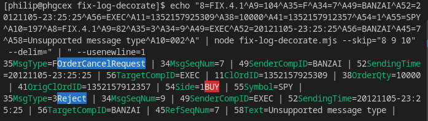

A Node.js command line parser for FIX protocol messages. This decorates FIX messages with colours fieldnames and value lookups, making them easer to read.

## Install

* Node.js is required (https://nodejs.org/en/download/).
* Then `npm install -g fix-log-decorate` (or otherwise just use `npx fix-log-decorate` directly in the command line).

## Example

You can pipe FIX message containing logs to `fix-log-decorate`:

```sh
echo "8=FIX.4.1|9=61|35=A|34=1|49=EXEC|52=20121105-23:24:06|56=BANZAI|98=0|108=30|10=003|" | fix-log-decorate
```

Or use `npx fix-log-decorate`, here reading a log file in real time with `tail -f`, skipping heartbeats with `grep -v`, and using some switches to control output:

```sh
tail -f someFIXlog.log | \
grep -v 35=0 | \
npx fix-log-decorate --skip="8 9 10" --usenumber=0 --usenewline=1 --delim=" "
```

(Alternatively you could pipe to `node fix-log-decorate.mjs` with a local install).

## Screenshot



## Switches

```
    --usenumber=[1|0]
    --usename=[1|0]
    --usevalue=[1|0]
    --uselookup=[1|0]
    --usenewline=[0|1]
    --skip="9 35 BeginString",
    --keep="8 10 MsgType"
    --delim=|
```

* `--use...` switches control which elements are shown. They default to on (1), except for `--usenewline`, which defaults to off (0). 
* `--skip` and `--keep` allow exclusion or inclusion of fields by name or number. Default to nothing (i.e. include all fields). Fields are delimited by spaces.
* `--delim` sets the output delimiter (both "|" and ascii code 1 are accepted as delimiter input). Default is "|".

## References

* Fix protocol: https://www.fixtrading.org/what-is-fix/
* NPM: https://www.npmjs.com/package/fix-log-decorate
* Online fix parser: https://fixparser.targetcompid.com/
