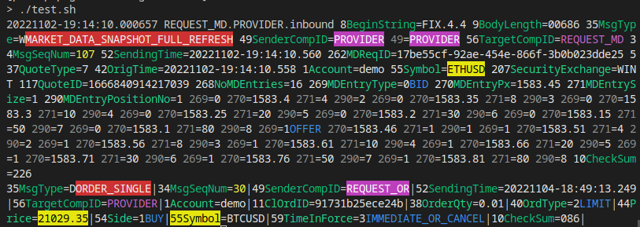

A Node.js command line parser for FIX protocol messages. This decorates FIX messages with colours fieldnames and value lookups, making them easer to read.

## Install

* Node.js is required (https://nodejs.org/en/download/).
* Then `npm install -g fix-log-decorate` (or otherwise just use `npx fix-log-decorate` directly in the command line).

To update, you can run `npm update -g fix-log-decorate`

## Example

You can pipe FIX message containing logs to `fix-log-decorate`:

```sh
echo "8=FIX.4.1|9=61|35=A|34=1|49=EXEC|52=20121105-23:24:06|56=BANZAI|98=0|108=30|10=003|" \
| fix-log-decorate
```

Or use `npx fix-log-decorate`, here reading a log file in real time with `tail -f`, and using some switches to control output. `grep --line-buffered -v 35=0` will skip heartbeats: `--line-buffered` is sometimes necessary to get lines to pass through the pipe.

```sh
tail -f someFIXlog.log | \
grep --line-buffered -v 35=0 | \
npx fix-log-decorate --skip="8 9 10" --usenumber=0 --usenewline=1 --delim=" "
```

(Alternatively you could pipe to `node fix-log-decorate.mjs` with a local install).

## Screenshot



## Switches

```
    --usenumber=[1|0]
    --usename=[1|0]
    --usevalue=[1|0]
    --uselookup=[1|0]
    --usenewline=[0|1]
    --skipseen=[1|0]
    --skip="9 35 BeginString",
    --keep="8 10 MsgType"
    --highlight="52 Symbol BTCUSD 1583.81"
    --delim=|

    --help
    --version
```

* `--use...` switches control which elements are shown. They default to on (1), except for `--usenewline`, which defaults to off (0).
* `--skipseen` controls whether field and lookup values which are repeated are displayed again. This is useful to keep output size for messages with repeated fields (such as market data) small. Defaults to on (1). 
* `--skip` and `--keep` allow exclusion or inclusion of fields by name or number. Default to nothing (i.e. include all fields). Fields are delimited by spaces.
* `--highlight` is a space delimited list of field names, numbers, values and lookup values to highlight in yellow, to make them stand out. Defaults to nothing.
* `--delim` sets the output delimiter (both "|" and ascii code 1 are accepted as delimiter input). Default is "|".

## References

* Fix protocol: https://www.fixtrading.org/what-is-fix/
* NPM: https://www.npmjs.com/package/fix-log-decorate
* Online fix parser: https://fixparser.targetcompid.com/
